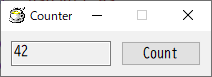
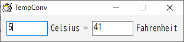
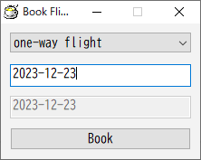
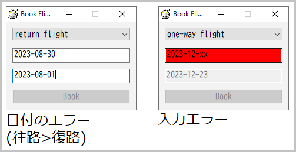

# 7GUIs with HSP

WIP

tasks: https://7guis.github.io/7guis/

## 1. Counter

仕様:

> https://7guis.github.io/7guis/tasks#counter

- スクリーン上に数値の入力欄 **T** とボタン **B** がある
- 入力欄T: はじめ0が入っている
- ボタンB: 押すたび、入力欄の数値が1増える

実装:

[counter.hsp](./counter.hsp)

- input, button命令を使う
- inputを読み取り専用にするため `EM_SETREADONLY` メッセージを使う

## 2. Temperature Converter (温度変換器)

挑戦: 双方向データフロー、テキスト入力

仕様:

> https://7guis.github.io/7guis/tasks#temp

- 2つの入力欄 **Tc**、**Tf** がある
    - Tc: 摂氏温度(celsius)の入力欄
    - Tf: 華氏温度(fahrenheit)の入力欄
- はじめはどちらも空。一方に数値が入力されたら、他方に同じ温度を(摂氏/華氏の変換をして)設定する。数値でない入力については自動更新をしない
- 変換式:
    - `C = (F - 32) * (5/9)`
    - `F = C * (9/5) + 32`

実装:

[temp_conv.hsp](temp_conv.hsp)

- input命令を2つ使う
- oncmd命令で `WM_COMMAND` メッセージを購読し、入力欄の `EN_CHANGE` 通知を受け付ける
- 入力時にobjprm命令で他方の入力欄を更新する
- 注意: objprm命令による更新でも `WM_COMMAND` メッセージが送られるため、繰り返し更新が発生してしまう。これを避けるため、スクリプトでの更新中を示す変数(updating)を用意し、その間は変更通知を無視する

## 3. Flight Booker (飛行機予約器)

挑戦: 制約

仕様:

> https://7guis.github.io/7guis/tasks#flight

- コンボボックス **C** があり、2つの選択肢を持つ
    - 片道 (one-way flight) (既定値)
    - 往復 (return flight)
- テキストボックス **T1**, **T2** があり、それぞれ往路出発日(start date)と帰路出発日(return date)の入力欄である
    - 既定値は適当な日付で、どちらも同じ日付にする
- ボタン **B** を押すと指定した予約を送信し、その詳細をダイアログで表示する
- 制約(constraints):
    - 片道が選択されているとき、T2を無効状態にする
    - 往復が選択されていて、往路より帰路の出発日のほうが後であるとき、ボタンBを無効状態にする
    - テキストボックスT (T1またはT2) が無効ではなく、入力が日付として有効でないとき、その背景色を赤にして、ボタンBを無効状態にする

実装:

[flight.hsp](flight.hsp) (※不完全)

- combox, input, button命令を使う
- 入力の変更検知:
    - combox, inputのどちらも、oncmd命令で `WM_COMMAND` メッセージを購読し、変更の通知を受け取れる (温度変換と同様)
- 入力欄の無効化:
    - objenable命令を使う
- 入力欄の背景色の変更:
    - 入力欄が再ペイントされるたびに、[WM_CTLCOLOREDIT] メッセージがウィンドウに送られてくる
    - 入力が正常なら白のブラシ、不正なら赤のブラシを返せばいい
    - 白のブラシは `GetStockObject(WHITE_BRUSH)` で取得できる
    - 赤のブラシは `CreateSolidBrush()` で作る
        (アプリの開始時に作っておく。アプリ終了時まで使うので、破棄していない)
- 日付の計算:
    - 日付の文字列形式:
        `yyyy-MM-dd` 形式 (RFC3339) のみ扱う
        (もっと柔軟なほうがいい)
    - 日付の有効性: 日付が有効かどうかの判定は **未実装** で、`2023-02-31` (存在しない日付) でも通ってしまう……
    - 日付の大小比較:
        - `yyyy-MM-dd` 形式なので、そのまま文字列として比較すれば日付の前後関係を判定できる
        - HSP3では、文字列は `(s != t) <= 0` のように比較できる

## 4. ...

[WM_CTLCOLOREDIT]: https://learn.microsoft.com/en-us/windows/win32/controls/wm-ctlcoloredit
