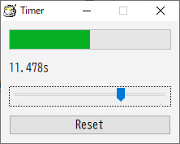
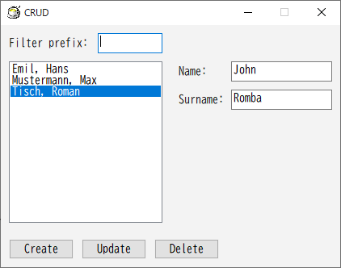
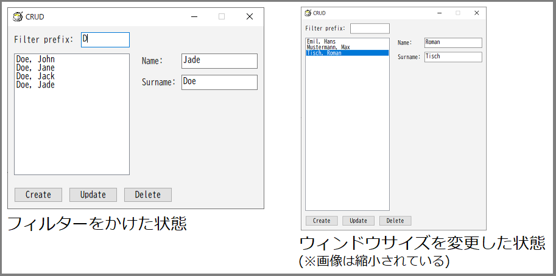

# 7GUIs with HSP

WIP

tasks: https://7guis.github.io/7guis/

## 1. Counter

仕様:

> https://7guis.github.io/7guis/tasks#counter

- スクリーン上に数値の入力欄 **T** とボタン **B** がある
- 入力欄T: はじめ0が入っている
- ボタンB: 押すたび、入力欄の数値が1増える

実装:

[counter.hsp](./counter.hsp)

- input, button命令を使う
- inputを読み取り専用にするため `EM_SETREADONLY` メッセージを使う

## 2. Temperature Converter (温度変換器)

挑戦: 双方向データフロー、テキスト入力

仕様:

> https://7guis.github.io/7guis/tasks#temp

- 2つの入力欄 **Tc**、**Tf** がある
    - Tc: 摂氏温度(celsius)の入力欄
    - Tf: 華氏温度(fahrenheit)の入力欄
- はじめはどちらも空。一方に数値が入力されたら、他方に同じ温度を(摂氏/華氏の変換をして)設定する。数値でない入力については自動更新をしない
- 変換式:
    - `C = (F - 32) * (5/9)`
    - `F = C * (9/5) + 32`

実装:

[temp_conv.hsp](temp_conv.hsp)

- input命令を2つ使う
- oncmd命令で `WM_COMMAND` メッセージを購読し、入力欄の `EN_CHANGE` 通知を受け付ける
- 入力時にobjprm命令で他方の入力欄を更新する
- 注意: objprm命令による更新でも `WM_COMMAND` メッセージが送られるため、繰り返し更新が発生してしまう。これを避けるため、スクリプトでの更新中を示す変数(updating)を用意し、その間は変更通知を無視する

## 3. Flight Booker (飛行機予約器)

挑戦: 制約

仕様:

> https://7guis.github.io/7guis/tasks#flight

- コンボボックス **C** があり、2つの選択肢を持つ
    - 片道 (one-way flight) (既定値)
    - 往復 (return flight)
- テキストボックス **T1**, **T2** があり、それぞれ往路出発日(start date)と帰路出発日(return date)の入力欄である
    - 既定値は適当な日付で、どちらも同じ日付にする
- ボタン **B** を押すと指定した予約を送信し、その詳細をダイアログで表示する
- 制約(constraints):
    - 片道が選択されているとき、T2を無効状態にする
    - 往復が選択されていて、往路より帰路の出発日のほうが後であるとき、ボタンBを無効状態にする
    - テキストボックスT (T1またはT2) が無効ではなく、入力が日付として有効でないとき、その背景色を赤にして、ボタンBを無効状態にする

実装:

[flight.hsp](flight.hsp) (※不完全)

- combox, input, button命令を使う
- 入力の変更検知:
    - combox, inputのどちらも、oncmd命令で `WM_COMMAND` メッセージを購読し、変更の通知を受け取れる (温度変換と同様)
- 入力欄の無効化:
    - objenable命令を使う
- 入力欄の背景色の変更:
    - 入力欄が再ペイントされるたびに、[WM_CTLCOLOREDIT] メッセージがウィンドウに送られてくる
    - 入力が正常なら白のブラシ、不正なら赤のブラシを返せばいい
    - 白のブラシは `GetStockObject(WHITE_BRUSH)` で取得できる
    - 赤のブラシは `CreateSolidBrush()` で作る
        (アプリの開始時に作っておく。アプリ終了時まで使うので、破棄していない)
- 日付の計算:
    - 日付の文字列形式:
        `yyyy-MM-dd` 形式 (RFC3339) のみ扱う
        (もっと柔軟なほうがいい)
    - 日付の有効性: 日付が有効かどうかの判定は **未実装** で、`2023-02-31` (存在しない日付) でも通ってしまう……
    - 日付の大小比較:
        - `yyyy-MM-dd` 形式なので、そのまま文字列として比較すれば日付の前後関係を判定できる
        - HSP3では、文字列は `(s != t) <= 0` のように比較できる

## 4. Timer

挑戦: 並行性、ユーザーとシグナルの相互作用、レスポンシブ性

仕様:

> https://7guis.github.io/7guis/tasks#timer

- ゲージGとラベルがあり、実行中のタイマーの経過時間を表示する
- スライダーSでタイマーの継続時間(duration) **d** を調整できる
    - タイマーが実行中でも設定を変更でき、設定が変更されたらタイマーをリセットする
    - スライダーを少しでも動かしたら設定の変更とみなす (スライダーのつまみを「離した」ときだけはない)
- ボタン **R** を押すと、タイマーをリセットする

実装:

[timer.hsp](timer.hsp)

- ゲージはWin32 APIの [ProgressBar] コントロールを使う
    - winobj命令を使って配置できる
- スライダーはWin32 APIの [Trackbar] コントロールを使う
- タイマーは [ウィンドウタイマー](http://chokuto.ifdef.jp/advanced/usertimer.html) を参照
    - (`SetTimer` でタイマーを作り、`KillTimer` で破棄する。`WM_TIMER` メッセージを購読して通知を受け取る)
    - タイマーは16ミリ秒ごとに設定する。これにより、1秒あたり60回ぐらいの頻度で通知を受け取れる (1000/60 ≒ 16)
    - タイマーの通知を受け取るたびに、タイマーの開始時刻と現在時刻の差を求めて、プログレスバーの進捗や経過時間の表示を更新する
        - 経過時間の取得には [timeGetTime] 関数を使う
        - 持続時間を過ぎたら、タイマーを破棄する
    - タイマーをリセットするときは、いまタイマーが動いているなら破棄し、新しくタイマーを作る
        - タイマーが動いているかどうかを変数で持つ (is_timer_set)。タイマーをリセットするときはこの変数を参照し、タイマーの破棄が必要か判断する
- 入力の変更:
    - トラックバーの変更は [WM_HSCROLL] メッセージで受け取れる
        - つまみをドラッグすると、wparamのLOWORDが `TB_THUMBTRACK` であるメッセージが送られてきて、wparamのHIWORDにトラックバーの値が渡される
        - (トラックバーの操作方法によっては通知が来ない?)

## 5. CRUD

挑戦: PDS(プレゼンテーションとドメインの分離)、変更操作の管理、非自明なレイアウトの構築

仕様:

> https://7guis.github.io/7guis/tasks/#crud

- リストボックスLがあり、ここに人物のリストを表示する
    - リストボックスの高さはウィンドウに合わせて伸縮する
- テキストボックス **Tp** はプレフィックス(prefix)の入力欄である。これに入力されている文字列で始まる名前に持つ人物で、リストを絞り込む
    - リストの絞り込み処理はプレフィックスが変化するたびに行う (エンターキーを押したときだけではない)
- テキストボックス **Tn**, **Ts** はそれぞれ、人物の名前・姓の入力欄である
- ボタンが3つある:
    - ボタン **Bc** (Create) を押すと、Tn, Ts に入力されている名前で人物を1件登録する
    - ボタン **Bu** (Update) を押すと、リストで選択中の人物の名前を、Tn, Ts に入力されている名前に更新する
    - ボタン **Bd** (Delete) を押すと、リストで選択中の項目を削除する
- リストボックスで項目が選択されたとき、その人物の名前・姓を入力欄に設定する

実装:

[crud.hsp](crud.hsp)

- listbox, input, button命令を使う
- 入力の変更検知: oncmd命令でウィンドウメッセージ `WM_COMMAND` を受け付けることで、プレフィックスの変更、リストボックスの項目選択を検知できる (温度変換と同様)
- データの持ちかた:
    - 人物データの件数を `person_count` 変数で持ち、`i` 番目の人物の名前・姓をそれぞれ配列要素 `person_names(i)`, `person_surnames(i)` で持つ
        - 削除操作によって配列が「歯抜け」になることを表現するため、`person_deleted(i)` で人物のデータが削除されているかを持つ (0: 未削除, 1: 削除済み)。削除済みの要素は無視する
    - 人物に関連して計算可能な値を持つための配列も用意する
        - 人物の名前・姓を `"姓, 名"` という形式の文字列で扱う。この文字列を生成する機能の重複を防ぐため、`person_fullnames(i)` でその計算結果を持つ。これは人物の名前・姓が変化するたびに再計算する
        - リストの絞り込み処理の結果として、人物がリストに表示されているかどうかを `person_visible(i)` で持つ (0: 非表示, 1: 表示)。これによりリストの絞り込み処理の重複を防ぐ。これはプレフィックスが変化するたびに再計算する
    - フィルター済みの人物のリストとしてpersonsとは別の配列を用意する。`view_count` をその件数 (リストボックスの項目数) とし、リストに含まれるi番目の人物を `view_person_indexes(i)` で持つ
        - `view_person_indexes(i)` にはpersons配列のインデックスを格納する
- プレフィックスの変更時:
    - リストの絞り込み処理を行う。それぞれの人物が条件を満たす (フルネームがプレフィックスの文字列で始まる) かどうかを再計算し、フィルター済みの人物のリスト(view配列)を再構築する
    - view配列にもとづいて、リストボックスの全項目を置き換える
    - もともと選択されていた人物が、更新後のリストにも含まれているなら、その項目を選択状態にする
        - (含まれていないなら、リストは未選択の状態のままになる)
- リストの項目の選択時:
    - 選択された項目のインデックスを `vi` とすると、対応する人物のインデックスは `view_person_indexes(vi)` である
    - その人物の名前・姓はpersons配列を参照して取得できる。これらの値で入力欄を更新する
- ボタンの処理:
    - 作成(Create): 入力値をもとにpersons配列に人物データを追加する
        - 追加された人物がリストに表示されるなら、view配列の末尾に追加する。
            リストボックスの末尾に対応する項目を追加し、それを選択状態にする
            - (※フィルターを通らない場合、表示上何も起きない)
    - 更新(Update): 選択されている項目があるならそれに対応する人物データを、入力値をもとに更新する
        - 選択されているリスト項目のテキストを更新する
            - リストボックスに更新用のメッセージはなさそうなので、代わりに、その項目を削除し、同じ位置に新しい項目を挿入し、それを選択状態にする
    - 削除(Delete): 選択されている項目をがあるならそれに対応する人物データをpersons配列から削除する (`person_deleted(pi) = 1` にする)
        - view配列からその位置の項目を削除する。リストボックスのその位置の項目を削除し、代わりに近い位置にある項目を選択する
            - 配列の末尾以外の要素の削除処理はややこしい (後方の要素を前方に詰める)
        - 選択状態の更新:
            - リストの末尾の項目を削除した場合、項目が1つ以上あるなら、その1つ前の項目を選択状態にする。削除後にリストが空になるなら、選択はしない
            - 末尾以外の項目を削除した場合、同じ位置にきた項目を選択状態にする
            - 選択後、名前・姓の入力欄を更新する
- レイアウトの更新:
    - HSP3のデフォルトのウィンドウは大きさを変更できない (端をドラッグできない)。そのウィンドウは非表示にして、別のウィンドウをscreen命令で作る
        - screen命令に指定する「初期化する画面サイズ」がそのウィンドウの最大サイズになる。これには適当に大きな値を指定すればよくて、ディスプレイの大きさ (`ginfo_dispx`, `ginfo_dispy`) を使うとちょうどいい
    - ウィンドウの大きさが変化するたび、ウィンドウメッセージ `WM_SIZING` が送られてくる。oncmd命令でこのメッセージを受け取り、各オブジェクトの位置・大きさを変更したり、ウィンドウ内を再描画したりする
        - `MoveWindow` 関数でオブジェクトの位置・大きさを変更できる
        - オブジェクトの最適な位置・大きさは、がんばって計算する
    - 備考: listboxの高さは行の高さの整数倍にしかできないため、ボタンとの間隔は一定にならない

## 6. Circle Drawer

挑戦: undo/redo、カスタムドロー、ダイアログ制御

仕様:

> https://7guis.github.io/7guis/tasks/#circle

- キャンバス領域:
    - 左クリックするとその位置を中心に円を配置する (クリック箇所にすでに円がある場合は配置しない)
    - マウスが円の上にあるかぎり、その円は選択状態とみなす (複数の円が該当する場合は、中心点がマウスにもっとも近いものから1つを選ぶ)。選択状態の円は内部を灰色で塗る
    - 円の上で右クリックしたとき、その選択状態の編集ダイアログを出す
    - 編集ダイアログにはスライダーSがあり、円の直径を調整できる (キャンバス即座に反映する)
- undo/redoボタンがある。undoボタンを押すと直前の操作を取り消し、redoボタンを押すと直前のundoを取り消す
    - 直前の操作は円の配置か、円の直径の変更 (ダイアログを閉じる前の状態に戻す)

実装:

[circle.hsp](circle.hsp) (**WIP**)

- 編集ダイアログ
    - screen命令で作る
        - オプションを指定して非表示、固定サイズ、ツールウィンドウにする
    - トラックバーを配置する (Timerを参照)
    - 編集の開始:
        - 編集中状態にする (`editing == 1`)
        - 編集中の円のインデックスを持つ
        - トラックバーの位置を直径に合わせる
    - 編集の終了: onexitでウィンドウが閉じられようとしているときに処理を挟める。編集ダイアログが閉じられようとしているなら、編集の終了処理を行う (メインウィンドウが閉じられようとしているなら、アプリの終了処理を行う)
    - モーダル性: screen命令で作ったウィンドウは「モーダル」ではない。つまり、そのウィンドウが開いている間にほかのウィンドウも操作できる (dialog命令なら「モーダル」なので操作できない)。編集中に円の追加やundoなどが行われるとややこしいので、モーダルにしたい (というかそういう仕様のはず)
        - メインループの開始時にアクティブなウィンドウが編集ダイアログでなければ、自動的に編集ダイアログをアクティブにしなおすという処理を入れる
- データの持ちかた:
    - 円の個数を `circle_count` とし、i番目の円のX・Y座標をそれぞれ `circle_x(i)`, `circle_y(i)` で持つ (CRUDのpersons配列と同様)
    - 円の直径は `circle_diam(i)` で持つ
- メインループ:
    - (いままでのタスクはstop命令で処理を止めていた が、今回はメインループを回す。onclickやWM_MOUSEMOVEを使えばイベント駆動にもできるはず)
    - マウスの位置:
        - システム変数mousex, mouseyでウィンドウ内におけるマウスの位置を取得できる。ただしこれらのシステム変数は、マウスがのウィンドウ外にある状態では正確な値にならない。マウスがウィンドウ内にあることを判定し、その場合のみマウスの位置を取得する
        - このアプリではキャンバスの左上を基準とするマウスの位置を知りたいので、キャンバス内にある場合のみ、キャンバスの左上を基準とする値に変換する。キャンバス外にある場合、マウスカーソルはないとしていい
    - stick命令で左クリックを検出し、円の追加を行う
    - 選択されている円を決定する:
        - 円の中心点と (キャンバス内の) マウスの位置の距離を計算する
        - 円と点の衝突判定 (`(x-a)^2 + (y-a)^2 <= r^2`) を使って、それぞれの円についてマウスがその上に乗っているか判定する
        - マウスが上に乗っている円の中でマウスとの距離が最小のものを1つ選んで選択状態とする
    - 円を描画する
    - 右クリックを検出し、選択中の円があれば、編集を開始する
- 課題:
    - キャンバスの端にある円がキャンバスからはみ出してしまう
    - 円が重なっているときに選択中の円が「手前」にこない (ほかの円が上から重ねて描画されてしまう)
- TODO: undo/redoは未実装

## 7. ...

[WM_CTLCOLOREDIT]: https://learn.microsoft.com/en-us/windows/win32/controls/wm-ctlcoloredit
[ProgressBar]: https://learn.microsoft.com/ja-jp/windows/win32/controls/progress-bar-control-reference
[Trackbar]: https://learn.microsoft.com/ja-jp/windows/win32/controls/trackbar-control-reference
[WM_HSCROLL]: https://learn.microsoft.com/ja-jp/windows/win32/controls/wm-hscroll
[timeGetTime]: https://learn.microsoft.com/ja-jp/windows/win32/api/timeapi/nf-timeapi-timegettime
